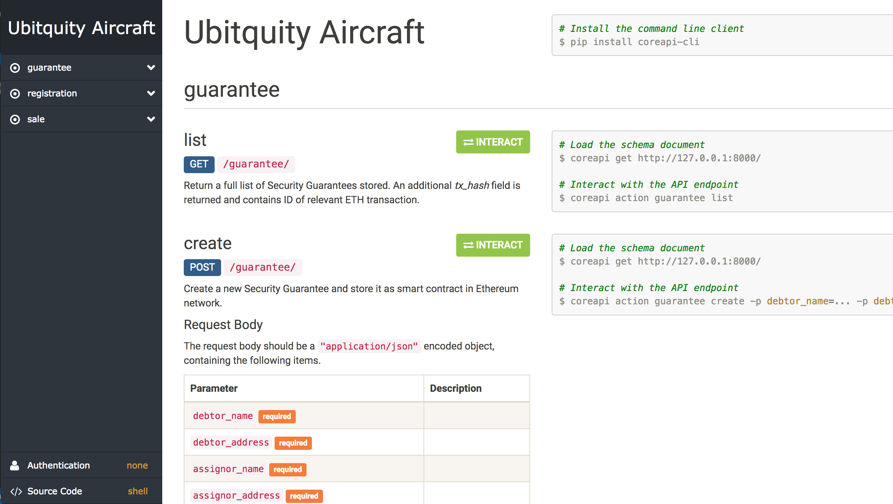

#### Overview
v1.1.1 (beta) API utilizes blockchain and off-blockchain data storage. Blockchain side enables users to ensure the authenticity of information related to Aircrafts, in particular its' current ownership and all the historical transactions. In addition, not encrypted metadata regarding transactions, among others contents of all the formulars, are stored in a centralized database.

Stucture of the database intentionally doesn't make use of relations to enable easy switch to decentalized storage (such as BitTorrent network, [StorJ](https://storj.io/), [FileCoin](https://filecoin.io/) etc.), in case it will be recommended in the future.

##### Blockchain contract storage
Fingerprints of all the fields from particular formulars are stored in [Ethereum](https://www.ethereum.org/) blockchain using smart contract writen in [Solidity language](https://solidity.readthedocs.io/en/v0.4.23/). They are generated using [SHA-224](https://en.wikipedia.org/wiki/SHA-2) cryptographic hash function, thus even a small change in the message will result in a mostly different hash, due to the [avalanche effect](https://en.wikipedia.org/wiki/Avalanche_effect). Example static content of contract stored in blockchain is presented below.
```json
{
   "transferee_name":"1123c599095afde714bd13b6457c482f77fa64a4fe988e2b3eb57750",
   "transferee_address":"78d8045d684abd2eece923758f3cd781489df3a48e1278982466017f",
   "transferee_nationality":"076d364250f10e230a3a28b2a4175d7431b24bc290a8fe4f76f7c054",
   "transferor_name":"bd1a1bdf6eae5ee14c3fee371cca975a5e052009bc67ce8f11cb7271",
   "transferor_address":"78d8045d684abd2eece923758f3cd781489df3a48e1278982466017f",
   "transferor_nationality":"78d8045d684abd2eece923758f3cd781489df3a48e1278982466017f",
   "manufacturer_and_model":"78d8045d684abd2eece923758f3cd781489df3a48e1278982466017f",
   "manufactured":"86665612b0b232cb14f8605473d3a7e0d2f303ff7003c6f8916fdc4f",
   "last_maintenance":"0298f0bd0619d34fbe508628cef38adc827fcf4d93c700588f607adc",
   "serial_number":"83dd3a4315c03a802c7ab4bf6b61b2bd847976c1295e8e7284ec59b7",
   "registration_number":"4cfc3a1811fe40afa401b25ef7fa0379f1f7c1930a04f8755d678474",
   "transfered":"86665612b0b232cb14f8605473d3a7e0d2f303ff7003c6f8916fdc4f"
}
```
Data are stored in custom contract, in its only sttic field, as serialized JSON string (in order to make contract elastic, in sense no ingerention in solidity is required to store additional data – all the required changes can be done by performing quite standard changes in model and serializer).

It is possible to switch to [ERC721](https://medium.com/crypto-currently/the-anatomy-of-erc721-e9db77abfc24) tokens with ease, but they seem to be a way too complex as it comes to the current needs.

#### Prerequirements and technology
API was developed in Python programing language, utilizing [Django REST framework](http://www.django-rest-framework.org/), as well as [web3.py](https://github.com/ethereum/web3.py) interface for interacting with the Ethereum blockchain and ecosystem. Apart from these and other python-related requirements (cf. _requirements.txt_ file) two additional application have two be installed in target system, namely:
- the [solc Solidity compiler](http://solidity.readthedocs.io/en/v0.4.21/installing-solidity.html) (used to compile smart contract before they are signed and send),
- [geth](https://geth.ethereum.org/) or equivalent interface for running a full ethereum node (since contract has to be signed using private key, for security purposes external services such as [Infura](https://infura.io/) do not provide this functionality).

After installing geth type `geth account new` in order to create an account that will be used for sending contract-related transactions to network. Account's keyfile and password should be provided in configuration file for proper system functioning (type `geth account list` to find out where is the relevant keystore file located).

#### Running, testing, API documentation
In order to install python requirements type `pip install -r requirements.txt`.

Make sure _geth_ is running and all the required settings are provided in the configuration file. System can be tested eg. using [Rinkeby Ethereum Testnet](https://www.rinkeby.io/). In this case _geth_ has to be run with an `--rinkeby` option.

Then type simply run server using `python manage.py runserver` command in the main project directory. It will be available at [127.0.0.1:8000](http://127.0.0.1:8000/) by default, where the detailed API documentation should appear.



#### Setup from scratch

Assuming you have ubuntu 18.04, run commands:

    sudo apt update
    sudo apt install python3-pip
    sudo apt install build-essential libssl-dev
    sudo apt install autoconf
    sudo apt install libtool
    sudo apt install libffi-dev
    sudo apt install libgmp-dev
    sudo apt install libsecp256k1-dev
    sudo apt install pkg-config
    sudo pip3 install -r requirements.txt
    
The last step - make sure that you are in the directory with code, and the `requirements.txt` is the right path.

After that run:

    python manage.py migrate
    python manage.py runserver 0:8080
    
This will run a development instance of your application.


##### Geth setup

Do a geth installation:

    sudo add-apt-repository -y ppa:ethereum/ethereum
    sudo apt-get update
    sudo apt-get install ethereum
    sudo apt-get install solc
    
Create a new geth account:

    geth account new
    
Remember the password - it is the `PASSWORD` setting in settings.py
You should also see something like this: `2ee833f885a517d557c204b78a2654f1e5020239`

This is `ACCOUNT` setting in settings.py, but prepend '0x' to it, so:

ACCOUNT = '0x2ee833f885a517d557c204b78a2654f1e5020239'

Run:
    
    geth account list
    
and pick a key file path from there:

    keystore:///home/vagrant/.ethereum/keystore/UTC--2018-08-31T11-38-42.406701178Z--2ee833f885a517d557c204b78a2654f1e5020239
    
Then the KEYFILE setting in settings.py is:

    /home/vagrant/.ethereum/keystore/UTC--2018-08-31T11-38-42.406701178Z--2ee833f885a517d557c204b78a2654f1e5020239

As mentioned earlier in the README - it is good to use test network for testing, this can be achieved by using `--rinkeby` attribute in the 
get run.

Also - in infura change api to `rinkeby`, eg.: rinkeby.infura.io/v3/909xxxxxxxxxxxxxxxxx

In the end your settings should look like this:

**PRODUCTION**

INFURA_URL = 'https://mainnet.infura.io/v3/909xxxxxxxxxxxxxxxxx'
KEYFILE = '/home/vagrant/.ethereum/keystore/UTC--2018-08-31T11-38-42.406701178Z--2ee833f885a517d557c204b78a2654f1e5020239'
PASSWORD = 'XXXXXXXXX'
CHAIN_ID = 1
ACCOUNT = '0x2eexxxxxxxxxxxxxxxxxxxxxxxxxxxxxxxxxxx'

**TEST**

INFURA_URL = 'https://rinkeby.infura.io/v3/909xxxxxxxxxxxxxxxxx'
KEYFILE = '/home/vagrant/.ethereum/keystore/UTC--2018-08-31T11-38-42.406701178Z--2ee833f885a517d557c204b78a2654f1e5020239'
PASSWORD = 'XXXXXXXXX'
CHAIN_ID = 4
ACCOUNT = '0x2eexxxxxxxxxxxxxxxxxxxxxxxxxxxxxxxxxxx'

with 

    geth --rinkeby
    
running.

As for `CHAIN_ID`:

    0: Olympic, Ethereum public pre-release testnet
    1: Frontier, Homestead, Metropolis, the Ethereum public main network
    1: Classic, the (un)forked public Ethereum Classic main network, chain ID 61
    1: Expanse, an alternative Ethereum implementation, chain ID 2
    2: Morden, the public Ethereum testnet, now Ethereum Classic testnet
    3: Ropsten, the public cross-client Ethereum testnet
    4: Rinkeby, the public Geth PoA testnet
    8: Ubiq, the public Gubiq main network with flux difficulty chain ID 8
    42: Kovan, the public Parity PoA testnet
    77: Sokol, the public POA Network testnet
    99: Core, the public POA Network main network
    7762959: Musicoin, the music blockchain
    61717561: Aquachain, ASIC resistant chain
    [Other]: Could indicate that your connected to a local development test network.
    
So in case of testing - you should have 4 set up, in case of production 1.


##### File Upload

1. Make sure you run the migrations:

    python3 manage.py migrate
    
2. Install paramiko (SSH connection handling):

    sudo -H pip3 install paramiko  
    
File Upload is done in two steps:

* first you need to upload file under POST <host>/files/
* in the response you will get the needed `file_hash`
* at this stage there will be an ssh connection triggered and the file metadata will reach the ubitquit.io servers
* you can use `file_hash` now in your contracts

3. Setup SSH credentials, as we do not want to store SSH credentials in the repository, do:

  * create a file in the project root dir: ssh-credentials (`touch ssh-credentials`)
  * place there a json with credentials (you can use `nano` editor -> `nano ssh-credentials`):
  
        {
            "username": "{username}",
            "password": "{password}"
        }
        
  * ask Nathan or Sam for the credentials
  
4. After all of it is done - run:

    python manage.py runserver 0:8080
    

# Environment setup

Install docker-compose: 

    sudo -H pip3 install docker-compose

Careful! Read the note about keyfile first.

Run:

    docker-compose build 
        
The above command will build your container.

Create the file in the project root dir:

    docker-compose-prod.yaml
    
Add following content to it

    version: '2'
    services:
      app-api:
        environment:
          - INFURA_URL=
          - KEYFILE=
          - PASSWORD=
          - CHAIN_ID=
          - ACCOUNT=
          - SSH_USERNAME=
          - SSH_PASSWORD=
          - UBITQUITY_HOST=45.32.1.3
          - UBITQUITY_FILE_PATH=/var/www/html/deeds/aicdocs
          

Fill the empty settings with proper values (this is extremely important).
The `UBITQUITY_` prefixed environment variables can be as they are.


> Note: keyfile

> Keyfile is private at should be known only to the owner. This is not included in the repository. When you create
your geth account (on rinkeby on any other network) - after listing the accounts you can see the key file path.
Copy this key to the root folder of the application and run `docker-compose build`, later on add env variable with PATH
as follows: KEYFILE=/app/UTC--2018-09-06T16-44-51....

> !IMPORTANT, be very careful with the key and working with version control system (git), never push your key to the 
repository.

After settings all of the variables, run:

    > docker-compose -f docker-compose.yaml -f docker-compose-prod.yaml up -d

You are ready to go. Go to the browser and type: <host_ip>:8080/ 

## Tips

To enter the docker container run:

    docker-compose exec app-api bash
